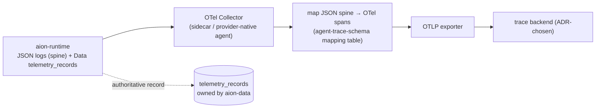

# Design Spec — Agent Trace Pipeline (OpenTelemetry)

- **Drives:** aion-docs
  [engineering/agent-trace-schema.md](https://github.com/Ceoloo/aion-docs/blob/main/engineering/agent-trace-schema.md),
  [2026 Runtime-Control Brief](https://github.com/Ceoloo/aion-docs/blob/main/research/2026-runtime-control-brief.md)
  signal 3
- **Priority:** P0 (schema now; pipeline when a mission needs cross-system
  tracing)
- **Status:** Design — not yet implemented

The trace **schema** (what is emitted, and its OTel mapping) is owned by
aion-docs and honored by the workload. The trace **pipeline** (collector,
exporter, backend, retention) is infrastructure — owned here, chosen by ADR when
a mission requires cross-system tracing. This spec designs that pipeline while
holding AION's portability and no-secrets invariants.

## Principle: the workload does not import a backend

The [deployment contract](../../contracts/deployment-contract.md) forbids the
runtime from importing a cloud/observability SDK for its ordinary function. That
does not change. AION Data already persists the full per-run spine in
`telemetry_records`; the runtime already emits the spine as **structured JSON
logs to stdout/stderr**. The trace pipeline is built by **collecting those
existing signals**, not by pushing a vendor SDK into the workload.

Two honest positions, one chosen by ADR at point of need:

1. **Collector-from-logs (preferred first step).** The Collector tails the
   runtime's stdout JSON, reconstructs spans from the spine per the
   [mapping table](https://github.com/Ceoloo/aion-docs/blob/main/engineering/agent-trace-schema.md),
   and exports OTLP. **Zero workload coupling** — the runtime stays a plain JSON
   logger; portability check unaffected.
2. **In-workload OTLP (only if logs are insufficient).** If reconstructed spans
   lose fidelity (e.g. precise span timing), a *thin, optional* OTLP emitter may
   be added behind config — off by default, no provider SDK (OTLP is vendor
   neutral), and never on the hot path in a way that can fail execution. This is
   an ADR decision, not a default.

## Provider profiles

Consistent with the existing provider-neutral posture (one workload, several
native infrastructures):

| Profile | Collector | Backend |
|---|---|---|
| **VPS** (active) | OTel Collector container in the Compose stack, tailing logs | self-hosted OTLP-compatible store (ADR-chosen) |
| **GCP** | Cloud Logging → Cloud Trace, or a Collector sidecar | Cloud Trace (OTLP-compatible) |
| **AWS** | ADOT Collector | X-Ray / OTLP store |

The **backend is not chosen here** — only the seam (OTLP) is fixed, so switching
backends is a profile change, never a workload change (capability-over-vendor
rule).

## Invariants this pipeline must preserve

- **No secrets, no payloads leave the workload.** The spine carries
  **references** (`aion.context_ref`, `aion.outcome_ref`), never raw context or
  arguments — enforced already in the log layer and restated here for spans.
  `arguments_hash` may be exported; arguments may not.
- **`telemetry_records` remains authoritative.** The exported traces are an
  interoperable *projection*; the durable, queryable source of truth stays in
  aion-data. A backend outage never loses the record.
- **Failures are ERROR spans**, risk/approval/cost always present — the mapping
  standard's carries are not dropped in transport.
- **Retention is bounded and documented** (minimal-but-sufficient posture); trace
  retention is shorter than the durable `telemetry_records` retention, since the
  backend is for interactive debugging, not the system of record.

## Cost-awareness

Trace export has its own cost. The Collector applies **tail-based sampling**
(keep all errors, all R2+ actions, all gated actions; sample R0/R1 successes) so
observability spend scales with *risk and failure*, not raw volume — aligning the
pipeline with the [economics](https://github.com/Ceoloo/aion-docs/blob/main/architecture/agent-economics.md)
mindset. Sampling never drops the authoritative `telemetry_records` row; it only
governs what reaches the interactive backend.

## What this spec deliberately does NOT do

- Does not select a trace backend or sampling SLA — ADR at point of need.
- Does not add a mandatory SDK to the workload — the default path is
  collect-from-logs.
- Does not redefine the trace schema — that is aion-docs; this consumes it.
