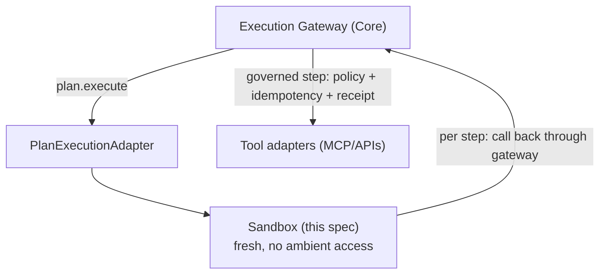

# Design Spec — Programmatic Execution Sandbox

- **Drives:** aion-docs
  [2026 Runtime-Control Brief](https://github.com/Ceoloo/aion-docs/blob/main/research/2026-runtime-control-brief.md)
  signal 2 (CodeAct/PTC);
  [aion-core programmatic-execution spec](https://github.com/Ceoloo/aion-core/blob/main/docs/design/programmatic-execution-and-a2a.md)
- **Priority:** P1 (build only if a measured prototype justifies it)
- **Status:** Design — not yet implemented

Programmatic execution lets one sandboxed plan chain many deterministic
operations, removing model round-trips (the brief's benchmark: ~52% faster, ~64%
fewer tokens). Core defines the `ExecutionPlan` contract and the
`PlanExecutionAdapter`; **the isolation technology is infrastructure and is owned
here.** Core never runs untrusted code and never learns which sandbox backs the
adapter.

## Requirement, not vendor

Per the capability-over-vendor rule, this spec fixes the **required isolation
properties**, not a product:

| Property | Requirement |
|---|---|
| **Fresh isolation per plan** | Each plan runs in a new, disposable execution context; no state bleeds between plans or from the host. |
| **No ambient host access** | The sandbox has no filesystem, network, env, or process access except the capabilities the plan was granted through the gateway. |
| **Capability-scoped egress** | The only outbound the sandbox can make is a call *back through the gateway* for a declared step capability — never a direct socket. |
| **Bounded resources** | CPU, memory, and wall-clock limits; a plan that exceeds them is killed and its run fails (a first-class, observed failure). |
| **Fast startup** | Startup cost must be small enough that the token/latency win survives it (the whole point of the prototype's measurement). |

Candidate technologies (micro-VM such as a Hyperlight-style VM, or a hardened
V8 isolate) are **ADR-chosen when the prototype justifies the build** — not
committed here.

## How it fits the deployment contract

- **The sandbox never bypasses the gateway.** Every step the plan takes is a
  governed execution — policy, risk, idempotency, and receipt apply *per step*
  (the OpenAI-PTC guarantee, in AION terms). The sandbox executes the plan's
  control flow; it does **not** hold tool credentials or reach tools directly.
- **Least privilege by construction.** The sandbox receives only the step
  capabilities the plan declared and policy cleared — the
  [security model](https://github.com/Ceoloo/aion-docs/blob/main/architecture/security-model.md)
  applied to code, not just calls.
- **Portability preserved.** The sandbox is a runtime dependency of the
  *PlanExecutionAdapter*, not of the base AION workload. Deployments that never
  use programmatic execution ship without it; the base
  [deployment contract](../../contracts/deployment-contract.md) is unchanged. A
  provider profile that enables plans declares the sandbox as an added component.

## Provider considerations

| Profile | Isolation option |
|---|---|
| **VPS** (active) | micro-VM or isolate process on the host, resource-capped via the container/runtime |
| **GCP / AWS** | provider micro-VM/sandbox service, or the same self-hosted isolate in the runtime image variant |

The seam is the `PlanExecutionAdapter` contract, so the sandbox implementation
differs by profile without touching Core, Data, or the base image.

## Safety posture

- **A sandbox escape is a security incident, not a bug.** The sandbox is treated
  as a trust boundary: it runs model-generated control flow, which is untrusted
  input. Defense in depth — no ambient access *and* resource caps *and*
  gateway-only egress — so a single failure does not grant tool access.
- **Failures are observed.** Timeouts, OOM, and denied steps produce structured
  failures on the run, with the same trace spine and (for completed steps)
  receipts — never silent partial execution.
- **Idempotency across partial plans** is Core's (`plan key + stepId`); the
  sandbox must be safely **re-runnable** from a partially-completed plan, which
  the fresh-context-per-plan requirement supports.

## What this spec deliberately does NOT do

- Does not select a sandbox vendor/engine — ADR when the prototype justifies it.
- Does not define the plan contract or per-step governance — that is Core.
- Does not add the sandbox to the base workload — it is an opt-in adapter
  component, portability preserved.
- Does not authorize building programmatic execution before the measured
  prototype shows the win (brief P1 discipline).
